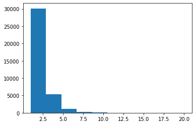
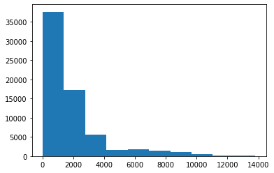

For the whole dataset, use [edge.csv](edge.csv) and [vertex.csv](vertex.csv). **For a smaller dataset**, run `generate data with specific size.exe` script to generate dataset with the size you want, the output will be `edge_sm.csv` and `vertex_sm.csv`


## Data

*Vertex:*

| ITAT | latitude          | longitude         | altitude |
| ---- | ----------------- | ----------------- | -------- |
| PEN  | 5.297140121459961 | 100.2770004272461 | 11       |

*Edge:*

| ITAT (start) | ITAT (dest) | Weight            |
| ------------ | ----------- | ----------------- |
| AER          | KZN         | 0.667554408910309 |


## Statistic

```python
    """
    General Statistic Data
    -------------------------------------------
    std of distance info:    2020.1571858791772
    mean of distance info:   1851.8100171736605
    median of distance info: 1195.8845359502072
    max of distance info:    13804.402294725593
    
    std of airline:          1.2853277067594049
    mean of airline:         1.8069758652340586
    median of airline:       1.0
    max of airline:          20.0
    """
```

*airline number:*



*route distance:*



## Weight formula

`W`: weight

`A`: airline number

`D`: route distance
$$
\begin{cases} W = \frac12 (\frac{1}{A}) + \frac12(0.95 + (\frac{D}{4500\cdot D_{max}}\cdot 0.05) &  D > 4275  \\ 
W = \frac12 (\frac{1}{A}) + \frac12(\frac{D}{4500}) , & D \leq 4275 \end{cases}
$$